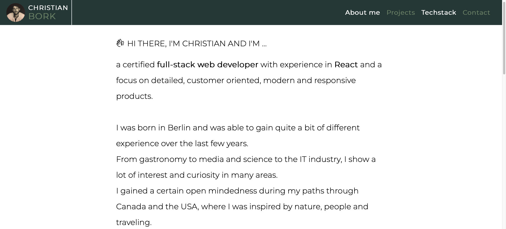
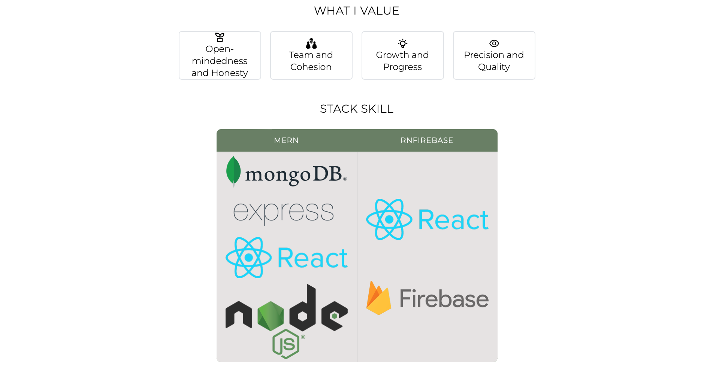
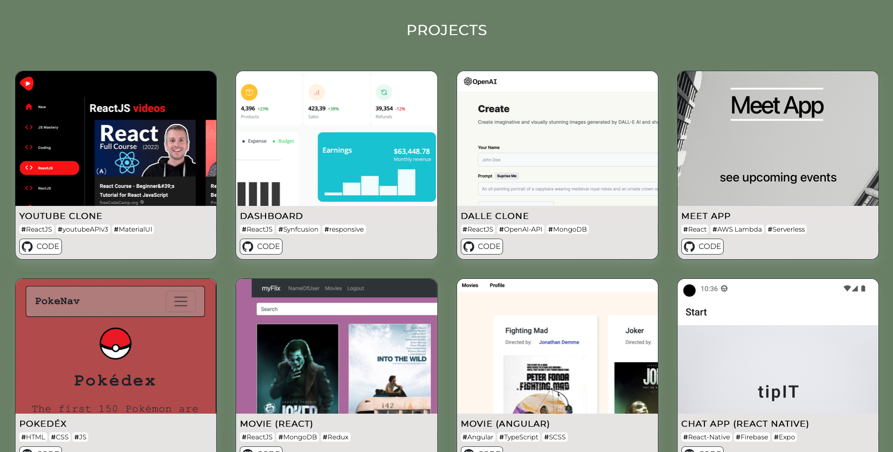
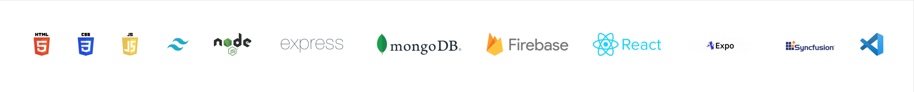
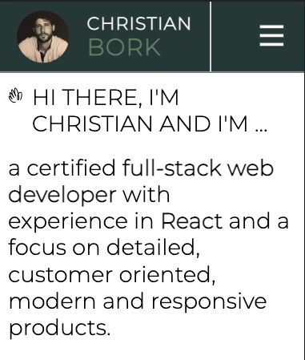
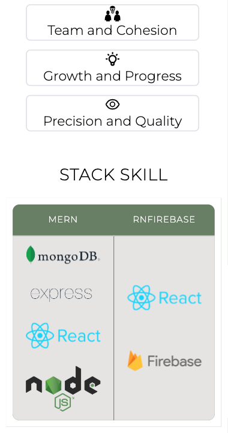
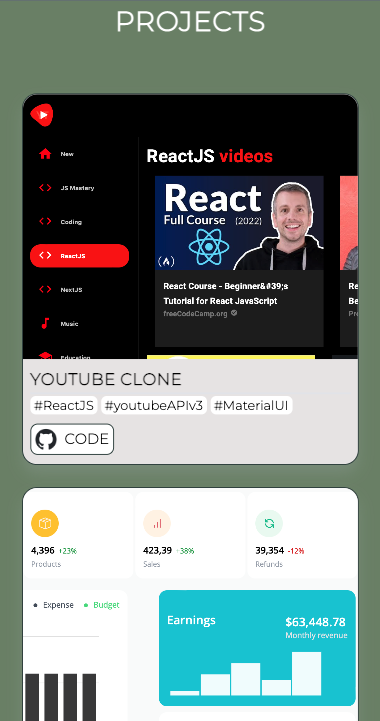
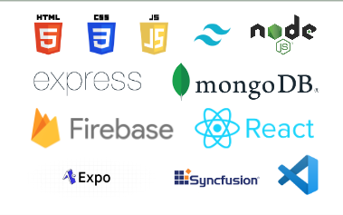
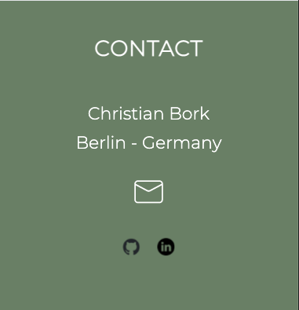

# portfolio website

## 1. [ General Info ](#general-info)
+ Welcome to my personal portfolio in which I present myself and my tech skills. I also showcase different projects I'm working on.

- The portfolio is devided into 4 menu points:
<code>About me</code>
<code>Projects</code>
<code>Techstack</code>
<code>Contact</code>

## 2. [ Technologies ](#technologies)
- [HTML](https://developer.mozilla.org/en-US/docs/Web/HTML): <code>Version 5</code>
- [TailwindCSS](https://v2.tailwindcss.com/docs): <code>Version 3.3.2</code>
- [JavaScript](https://developer.mozilla.org/en-US/docs/Web/JavaScript): <code>12th Edition – ECMAScript 2021</code>
- [ReactJS](https://react.dev): <code>Version 18.2.0</code>
- [react icons](https://react-icons.github.io/react-icons/): <code>Version 4.8.0</code>
- [AOS](https://michalsnik.github.io/aos/): <code>Version 2.3.4</code>

## 3. [ Deployment ](#deployment)
- this portfolio is deployed on the provider [Netlify](https://netlify.com)
- You can find the portfolio here: [PORTFOLIO](https://christianbork.netlify.app)

## 4. [ Contact Info ](#contact-info)
- built and designed by Christian Bork
- Berlin-Germany
- email: christianbork.work(at)gmail.com

## Screenshots

### Desktop Version

1. About me:

 
 

2. Projects:

 

3. Techstack:

 

4. Contact:

### Mobile Version

1. About me:

 

 

2. Projects:

 

3. Techstack:

 

4. Contact:

## Available Scripts

In the project directory, you can run:

### `npm start`

Runs the app in the development mode.\
Open [http://localhost:3000](http://localhost:3000) to view it in your browser.

The page will reload when you make changes.\
You may also see any lint errors in the console.

### `npm test`

Launches the test runner in the interactive watch mode.\
See the section about [running tests](https://facebook.github.io/create-react-app/docs/running-tests) for more information.

### `npm run build`

Builds the app for production to the `build` folder.\
It correctly bundles React in production mode and optimizes the build for the best performance.

The build is minified and the filenames include the hashes.\
Your app is ready to be deployed!

See the section about [deployment](https://facebook.github.io/create-react-app/docs/deployment) for more information.

### `npm run eject`

**Note: this is a one-way operation. Once you `eject`, you can't go back!**

If you aren't satisfied with the build tool and configuration choices, you can `eject` at any time. This command will remove the single build dependency from your project.

Instead, it will copy all the configuration files and the transitive dependencies (webpack, Babel, ESLint, etc) right into your project so you have full control over them. All of the commands except `eject` will still work, but they will point to the copied scripts so you can tweak them. At this point you're on your own.

You don't have to ever use `eject`. The curated feature set is suitable for small and middle deployments, and you shouldn't feel obligated to use this feature. However we understand that this tool wouldn't be useful if you couldn't customize it when you are ready for it.